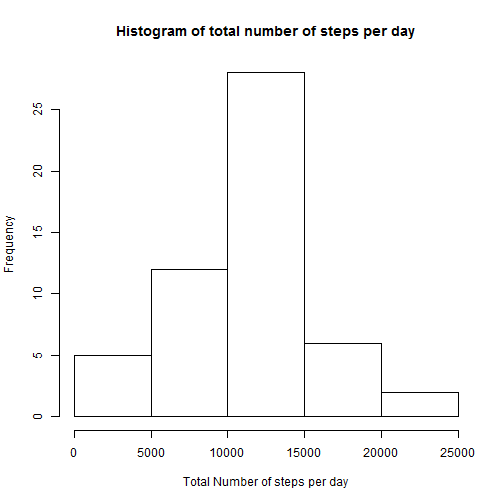
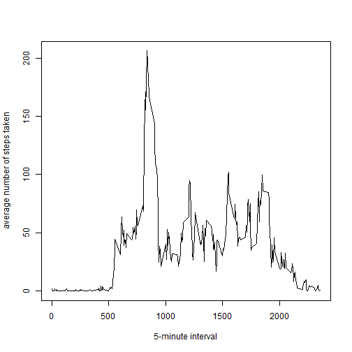
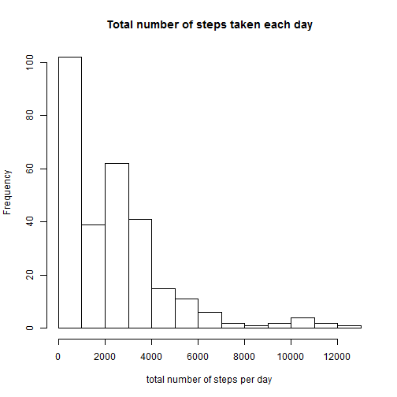

# Reproducible Research: Peer Assessment 1

## Loading and preprocessing the data


```r
data <- read.csv("activity.csv", header = TRUE)
```

```
## Warning: cannot open file 'activity.csv': No such file or directory
```

```
## Error: cannot open the connection
```

```r
data$steps <- as.numeric(data$steps)  # Convert the column to numeric
```


## What is mean total number of steps taken per day?

```r
library(plyr)
steps_day <- ddply(data, .(date), summarize, steps = sum(steps))  # Getting the total number of steps per day

steps_day_1 <- steps_day[complete.cases(steps_day$steps), ]  # Removing the NAs from the constructed data frame

hist(steps_day_1$steps, xlab = "Total Number of steps per day", main = "Histogram of total number of steps per day")
```

 

```r

mean(steps_day_1$steps)  # Getting the mean of the total steps per day
```

```
## [1] 10766
```

```r

median(steps_day_1$steps)  #getting the median for the total steps per day
```

```
## [1] 10765
```


## What is the average daily activity pattern?

```r
data1 <- data[complete.cases(data$steps), ]
steps_day_ave <- ddply(data1, .(interval), summarize, steps = mean(steps))  # Getting the total number of steps per day
plot(steps_day_ave$interval, steps_day_ave$steps, type = "l", xlab = "5-minute interval", 
    ylab = "average number of steps taken")
```

 

```r

## Time interval with the max number of steps
interval <- steps_day_ave[steps_day_ave$step == max(steps_day_ave$steps), 1]
```

```
## Warning: Name partially matched in data frame
```

```r
interval
```

```
## [1] 835
```


## Imputing missing values

```r
data_complete_rows <- complete.cases(data)
number_incomplete_rows <- table(data_complete_rows)[1]
number_incomplete_rows
```

```
## FALSE 
##  2304
```

```r

data_2 <- data
data_2 <- merge(data, steps_day_ave, by = "interval")
data_2$steps.x[is.na(data_2$steps.x)] <- data_2$steps.y[is.na(data_2$steps.x)]
data_2$steps.y <- NULL
data_2$steps <- data_2$steps.x
data_2$steps.x <- NULL

steps_day_sum <- ddply(data_2, .(interval), summarize, steps = sum(steps))  # Getting the total number of steps per day
hist(steps_day_sum$steps, xlab = "total number of steps per day", main = "Total number of steps taken each day")
```

 

```r

mean_total_number_steps_taken_per_day <- ddply(data_2, .(date), summarize, steps = mean(steps))  #
mean_total_number_steps_taken_per_day
```

```
##          date   steps
## 1  2012-10-01 37.3826
## 2  2012-10-02  0.4375
## 3  2012-10-03 39.4167
## 4  2012-10-04 42.0694
## 5  2012-10-05 46.1597
## 6  2012-10-06 53.5417
## 7  2012-10-07 38.2465
## 8  2012-10-08 37.3826
## 9  2012-10-09 44.4826
## 10 2012-10-10 34.3750
## 11 2012-10-11 35.7778
## 12 2012-10-12 60.3542
## 13 2012-10-13 43.1458
## 14 2012-10-14 52.4236
## 15 2012-10-15 35.2049
## 16 2012-10-16 52.3750
## 17 2012-10-17 46.7083
## 18 2012-10-18 34.9167
## 19 2012-10-19 41.0729
## 20 2012-10-20 36.0938
## 21 2012-10-21 30.6285
## 22 2012-10-22 46.7361
## 23 2012-10-23 30.9653
## 24 2012-10-24 29.0104
## 25 2012-10-25  8.6528
## 26 2012-10-26 23.5347
## 27 2012-10-27 35.1354
## 28 2012-10-28 39.7847
## 29 2012-10-29 17.4236
## 30 2012-10-30 34.0938
## 31 2012-10-31 53.5208
## 32 2012-11-01 37.3826
## 33 2012-11-02 36.8056
## 34 2012-11-03 36.7049
## 35 2012-11-04 37.3826
## 36 2012-11-05 36.2465
## 37 2012-11-06 28.9375
## 38 2012-11-07 44.7326
## 39 2012-11-08 11.1771
## 40 2012-11-09 37.3826
## 41 2012-11-10 37.3826
## 42 2012-11-11 43.7778
## 43 2012-11-12 37.3785
## 44 2012-11-13 25.4722
## 45 2012-11-14 37.3826
## 46 2012-11-15  0.1424
## 47 2012-11-16 18.8924
## 48 2012-11-17 49.7882
## 49 2012-11-18 52.4653
## 50 2012-11-19 30.6979
## 51 2012-11-20 15.5278
## 52 2012-11-21 44.3993
## 53 2012-11-22 70.9271
## 54 2012-11-23 73.5903
## 55 2012-11-24 50.2708
## 56 2012-11-25 41.0903
## 57 2012-11-26 38.7569
## 58 2012-11-27 47.3819
## 59 2012-11-28 35.3576
## 60 2012-11-29 24.4688
## 61 2012-11-30 37.3826
```

```r
median_total_number_steps_taken_per_day <- ddply(data_2, .(date), summarize, 
    steps = median(steps))  #
median_total_number_steps_taken_per_day
```

```
##          date steps
## 1  2012-10-01 34.11
## 2  2012-10-02  0.00
## 3  2012-10-03  0.00
## 4  2012-10-04  0.00
## 5  2012-10-05  0.00
## 6  2012-10-06  0.00
## 7  2012-10-07  0.00
## 8  2012-10-08 34.11
## 9  2012-10-09  0.00
## 10 2012-10-10  0.00
## 11 2012-10-11  0.00
## 12 2012-10-12  0.00
## 13 2012-10-13  0.00
## 14 2012-10-14  0.00
## 15 2012-10-15  0.00
## 16 2012-10-16  0.00
## 17 2012-10-17  0.00
## 18 2012-10-18  0.00
## 19 2012-10-19  0.00
## 20 2012-10-20  0.00
## 21 2012-10-21  0.00
## 22 2012-10-22  0.00
## 23 2012-10-23  0.00
## 24 2012-10-24  0.00
## 25 2012-10-25  0.00
## 26 2012-10-26  0.00
## 27 2012-10-27  0.00
## 28 2012-10-28  0.00
## 29 2012-10-29  0.00
## 30 2012-10-30  0.00
## 31 2012-10-31  0.00
## 32 2012-11-01 34.11
## 33 2012-11-02  0.00
## 34 2012-11-03  0.00
## 35 2012-11-04 34.11
## 36 2012-11-05  0.00
## 37 2012-11-06  0.00
## 38 2012-11-07  0.00
## 39 2012-11-08  0.00
## 40 2012-11-09 34.11
## 41 2012-11-10 34.11
## 42 2012-11-11  0.00
## 43 2012-11-12  0.00
## 44 2012-11-13  0.00
## 45 2012-11-14 34.11
## 46 2012-11-15  0.00
## 47 2012-11-16  0.00
## 48 2012-11-17  0.00
## 49 2012-11-18  0.00
## 50 2012-11-19  0.00
## 51 2012-11-20  0.00
## 52 2012-11-21  0.00
## 53 2012-11-22  0.00
## 54 2012-11-23  0.00
## 55 2012-11-24  0.00
## 56 2012-11-25  0.00
## 57 2012-11-26  0.00
## 58 2012-11-27  0.00
## 59 2012-11-28  0.00
## 60 2012-11-29  0.00
## 61 2012-11-30 34.11
```


## Are there differences in activity patterns between weekdays and weekends?


```r
data_3 <- data_2
data_3$date <- as.Date(data_3$date)
weekdays <- weekdays(data_3$date)
data_3$weekdays <- (weekdays == "Sunday") | (weekdays == "Saturday")
data_3$weekdays[data_3$weekdays == TRUE] <- "weekend"
data_3$weekdays[data_3$weekdays == FALSE] <- "weekday"
data_3$weekdays <- as.factor(data_3$weekdays)

weekdays_dataframe <- data_3[data_3$weekdays == "weekday", ]
weekends_dataframe <- data_3[data_3$weekdays == "weekend", ]

mean_total_number_steps_taken_weekdays <- ddply(weekdays_dataframe, .(interval), 
    summarize, steps = mean(steps))  #

mean_total_number_steps_taken_weekdays <- cbind(mean_total_number_steps_taken_weekdays, 
    weekdays = "weekday")

mean_total_number_steps_taken_weekends <- ddply(weekends_dataframe, .(interval), 
    summarize, steps = mean(steps))  #

mean_total_number_steps_taken_weekends <- cbind(mean_total_number_steps_taken_weekends, 
    weekdays = "weekend")

data_4 <- rbind(mean_total_number_steps_taken_weekdays, mean_total_number_steps_taken_weekends)

library(lattice)

xyplot(steps ~ interval | weekdays, data = data_4, layout = c(1, 2), type = "l")
```

 

